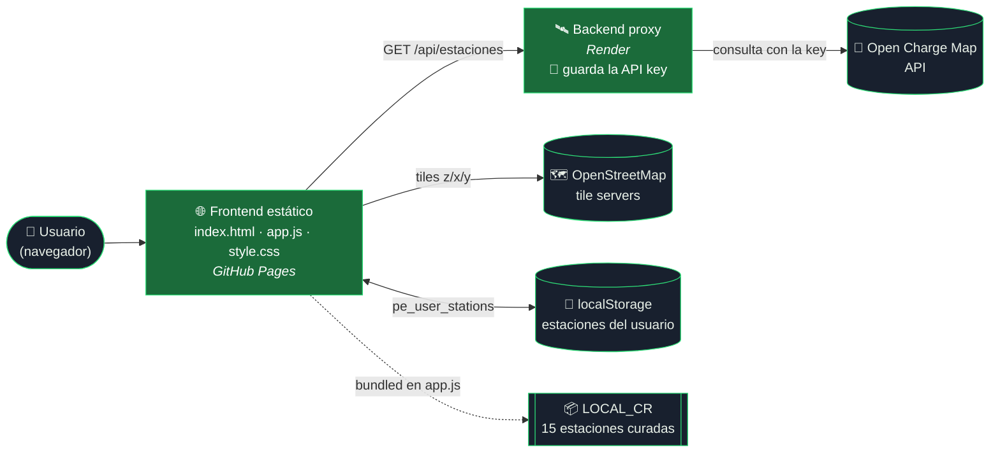
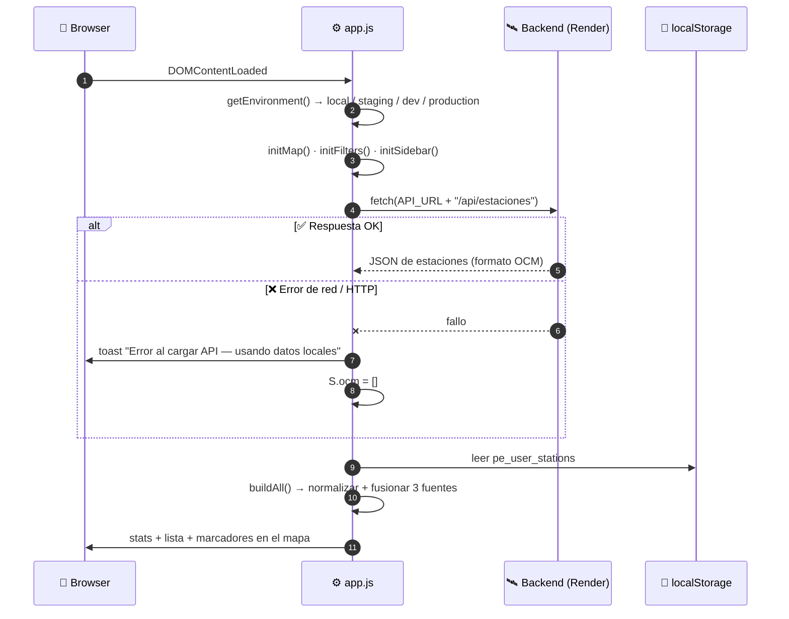
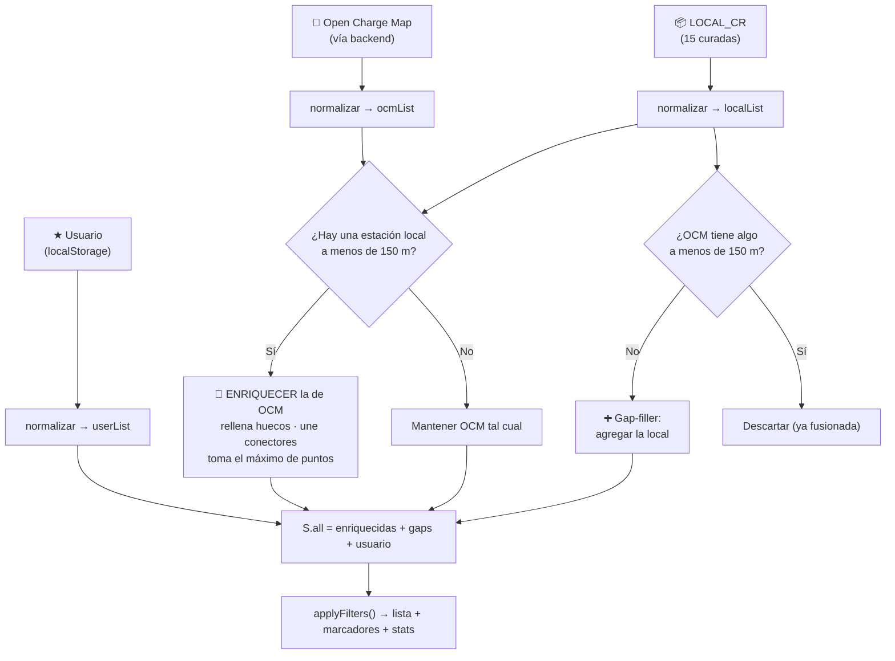
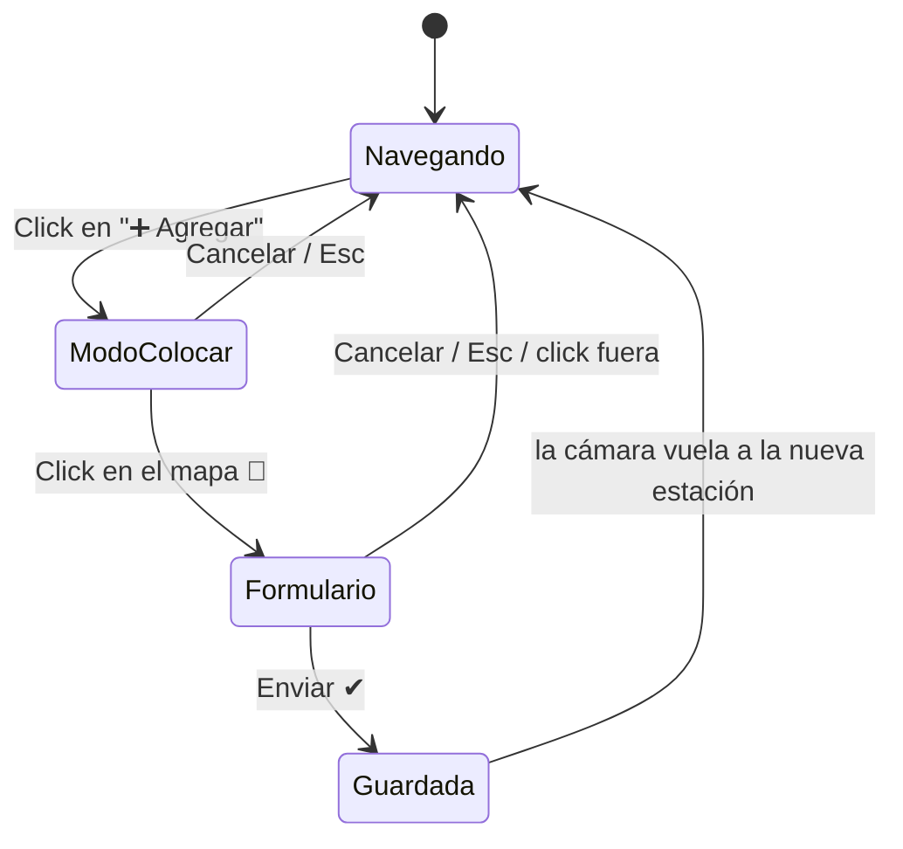
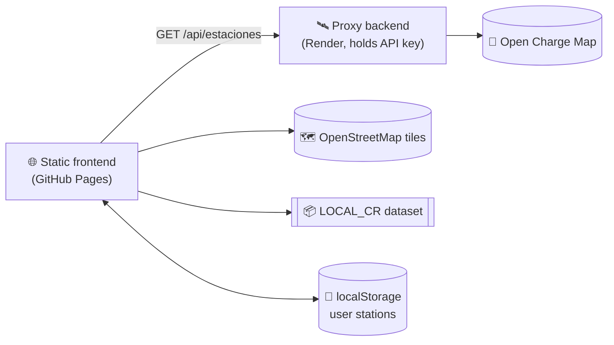

<div align="center">


# ⚡ PUNTO ELÉCTRICO CR ⚡

### El Waze de los cargadores para vehículos eléctricos en Costa Rica

**Mapa abierto · Datos fusionados de múltiples fuentes · Bilingüe ES/EN · Modo día/noche · Sin registro**

<br>

<a href="https://mikedmart.github.io/Punto-Electrico-CR/">
  
</a>

<br><br>

[](https://mikedmart.github.io/Punto-Electrico-CR/)
[](./LICENSE)
[](#-stack-técnico)
[](https://leafletjs.com/)
[](https://www.openstreetmap.org/)
[](https://openchargemap.org/)
[](#-contribuir)
[](https://github.com/mikedmart)

<br>

[](https://github.com/MikeDMart/Punto-Electrico-CR/stargazers)
[](https://github.com/MikeDMart/Punto-Electrico-CR/network/members)
[](https://github.com/MikeDMart/Punto-Electrico-CR/issues)
[](https://github.com/MikeDMart/Punto-Electrico-CR/commits)
[](https://github.com/MikeDMart/Punto-Electrico-CR)

<br>

[🇨🇷 **Español**](#-en-3-segundos) · [🇺🇸 **English**](#-english-version) · [🗺️ **Demo**](https://mikedmart.github.io/Punto-Electrico-CR/) · [🧠 **Arquitectura**](#-arquitectura) · [🤝 **Contribuir**](#-contribuir)

</div>

---

## 🎬 Míralo en acción

https://github.com/user-attachments/assets/6b1a2ec5-d387-496b-9fc2-0dafa45faf2e

<div align="center">

| 🌞 **MODO DÍA** | 🌚 **MODO NOCHE** |
|:---:|:---:|
| Paleta crema + verde bosque `#1b6b3a` | Azul medianoche + verde neón `#2edf78` |
| Pensado para sol tico a mediodía | Pensado para cargar a las 11 pm |

</div>

---

## 📑 Tabla de contenido

<details open>
<summary><b>Click para expandir / colapsar</b></summary>

1. [🔥 En 3 segundos](#-en-3-segundos)
2. [🎯 ¿Por qué existe?](#-por-qué-existe)
3. [✨ Features](#-features)
4. [🧠 Arquitectura](#-arquitectura)
5. [🔀 El motor de fusión de datos](#-el-motor-de-fusión-de-datos)
6. [➕ Cómo se agrega una estación](#-cómo-se-agrega-una-estación)
7. [🎨 Sistema de diseño](#-sistema-de-diseño)
8. [🧰 Stack técnico](#-stack-técnico)
9. [📂 Estructura del proyecto](#-estructura-del-proyecto)
10. [🚀 Correr en local](#-correr-en-local)
11. [🌍 Entornos y backend](#-entornos-y-backend)
12. [📦 Dataset local de Costa Rica](#-dataset-local-de-costa-rica)
13. [📐 Modelo de datos](#-modelo-de-datos)
14. [⌨️ Atajos de teclado](#️-atajos-de-teclado)
15. [🔎 SEO y analítica](#-seo-y-analítica)
16. [🛣️ Roadmap](#️-roadmap)
17. [🤝 Contribuir](#-contribuir)
18. [🙏 Créditos y atribuciones](#-créditos-y-atribuciones)
19. [📜 Licencia](#-licencia)
20. [🇺🇸 English version](#-english-version)

</details>

---

## 🔥 EN 3 SEGUNDOS

```text
┌──────────────────────────────────────────────────┐
│                                                  │
│   🗺️  ENCUENTRA DÓNDE CARGAR                     │
│   ➕  AGREGA ESTACIONES QUE FALTAN               │
│   🔌  FILTRA POR CONECTOR                        │
│        Type 2 · CCS · CHAdeMO · Type 1 · Tesla   │
│   💰  SABE SI ES GRATIS O DE PAGO                │
│   ⚡  VE LA POTENCIA MÁXIMA EN kW                │
│   📍  USA TU UBICACIÓN                           │
│   🌙  MODO OSCURO PARA LA NOCHE                  │
│   🌐  ESPAÑOL / ENGLISH CON UN CLIC              │
│                                                  │
└──────────────────────────────────────────────────┘
```

---

## 🎯 ¿POR QUÉ EXISTE?

En Costa Rica **cada vez hay más eléctricos**, pero la información de cargadores está regada: un poco en Facebook, un poco en apps extranjeras, un poco en la cabeza de alguien que "sabe dónde hay uno cerca del mall".

**Punto Eléctrico CR junta todo en un solo mapa**, y deja que **LA GENTE** complete lo que falta.

|  |  |
|---|---|
| ✅ | **Sin registro.** Abres y usas. |
| ✅ | **Sin burocracia.** Nadie te pide permiso para marcar un punto. |
| ✅ | **Sin API keys expuestas.** La llave de Open Charge Map vive en el backend, nunca en el navegador. |
| ✅ | **Sin frameworks.** HTML + CSS + JS puro. Carga rápido hasta en 4G de carretera. |
| ✅ | **Código abierto.** Fork, mejora, PR. |

---

## ✨ FEATURES

### 🗺️ Mapa

- **Leaflet 1.9.4** con tiles de **OpenStreetMap** (no necesita API key).
- **Clustering inteligente** con `leaflet.markercluster`: los grupos se dibujan en 3 tamaños (`small` < 10, `medium` < 50, `large` ≥ 50) y cargan por *chunks* para no congelar el navegador.
- **Mapa encerrado en Costa Rica**: `maxBounds` + `minZoom: 7` para que nadie se pierda en el Pacífico.
- **Pines con color por estado** y animación de pulso en el pin temporal.
- **`flyTo` animado** al seleccionar una estación (zoom 15, 0.8 s).
- **Geolocalización** con un botón: te lleva a tu posición (zoom 14).

### 🔍 Búsqueda y filtros (todos combinables)

| Filtro | Detalle |
|---|---|
| 🔎 **Texto** | Busca en nombre **y** dirección. *Debounce* de 220 ms. |
| 🏞️ **Provincia** | San José · Alajuela · Cartago · Heredia · Guanacaste · Puntarenas · Limón |
| 🟢 **Estado** | Todos · Operativo · Planeado |
| 🔌 **Conector** | Todos · Type 2 · CCS · CHAdeMO · Type 1 · Tesla |

Cada cambio recalcula **lista + marcadores + resultados** al instante.

### 📋 Panel de detalle

Click en un pin o en la lista y se abre el panel con:

- 🟢🟠🔴 **Estado** (Operativo / Planeado / Sin verificar / Fuera de línea)
- 🔢 **Puntos de carga** y ⚡ **potencia máxima**
- 🔌 **Lista de conectores** con su kW individual
- 💵 **Costo** · 🏢 **Operador** · 🕒 **Horario** · 📝 **Notas**
- 🔗 **Fuente de los datos** (OCM, Base CR Local, Usuario, o *Fusionado: A + B*)
- 📅 **Última verificación**
- 🧭 **"Abrir en Google Maps"** con las coordenadas exactas

### 🌐 Bilingüe de verdad

Diccionario completo `ES` / `EN` (60+ strings) aplicado con atributos `data-i18n` y `data-i18n-ph`. El cambio es **instantáneo**, sin recargar, y re-renderiza lista y panel de detalle. Las fechas se formatean con `es-CR` o `en-US` según el idioma.

### 🌗 Tema día / noche

Un solo atributo `data-theme` en `<html>` cambia **toda** la paleta vía CSS custom properties. El mapa nocturno se logra con un filtro CSS (`invert + hue-rotate + brightness`) sobre los tiles de OSM, así que **no hace falta una segunda fuente de tiles**.

### 📱 Responsive de verdad

Breakpoints en **1024 / 900 / 480 / 360 px**. En móvil el sidebar se oculta con un FAB y el formulario de alta se convierte en un **bottom sheet** con *drag handle*.

### 🧑‍🤝‍🧑 Comunidad

Cualquiera puede **marcar una estación en el mapa** y llenar el formulario. Las estaciones de usuario llevan insignia **★** y color ámbar para distinguirlas de las verificadas.

---

## 🧠 ARQUITECTURA



### 🔐 ¿Por qué un backend?

La API de Open Charge Map requiere una **key**. Ponerla en un `app.js` público es regalarla al mundo. La solución:

1. El **frontend** nunca conoce la key.
2. Pide `GET /api/estaciones` al **backend en Render**.
3. El backend agrega la key, consulta OCM y devuelve el JSON.

### 🔄 Ciclo de vida al cargar la página



> 💡 **Degradación elegante:** si el backend está dormido o caído, la app **no se rompe**: sigue mostrando las 15 estaciones locales y las que agregó el usuario.

---

## 🔀 EL MOTOR DE FUSIÓN DE DATOS

El corazón de la app es `buildAll()`: toma **tres fuentes distintas**, las **normaliza a un mismo esquema** y las **fusiona sin duplicar**.



### 📏 Reglas de la fusión

| Regla | Comportamiento |
|---|---|
| **Radio de coincidencia** | `ENRICH_RADIUS = 0.15` km (**150 metros**), calculado con distancia **Haversine** |
| **OCM manda** | Si OCM ya trae el dato, **no se pisa** |
| **Campos que se rellenan si faltan** | `network` · `cost` · `hours` · `address` · `province` |
| **Puntos de carga** | Se queda el **mayor** de las dos fuentes |
| **Conectores** | **Unión sin duplicados** (comparados por nombre) |
| **Estaciones locales sin par en OCM** | Entran como *gap-fillers* |
| **Estaciones de usuario** | Siempre se agregan al final |
| **Estaciones sin lat/lon** | Se descartan |
| **Marca de fusión** | `_sources: ['ocm','local_cr']` → se ve el icono 🔗 en la lista y *"Fusionado: Open Charge Map + Base CR Local"* en el detalle |

### 🔌 Categorización de conectores

`connCategory()` convierte los nombres libres que traen las fuentes en 5 categorías filtrables:

| El texto contiene… | Categoría |
|---|---|
| `type 2` · `mennekes` | `type2` |
| `type 1` · `j1772` | `type1` |
| `ccs` | `ccs` |
| `chademo` | `chademo` |
| `tesla` | `tesla` |
| *(cualquier otra cosa)* | `other` |

### 🚦 Códigos de estado (Open Charge Map)

| `StatusType.ID` | Estado | Color día | Color noche |
|:---:|---|:---:|:---:|
| `50` | 🟢 Operativo | `#1b6b3a` | `#2edf78` |
| `75` | 🟠 Planeado | `#c87c0a` | `#f0b429` |
| `150` | 🔴 Fuera de línea | `#c0392b` | `#ff6b6b` |
| otro | ⚪ Sin verificar | `#8a8570` | — |

---

## ➕ CÓMO SE AGREGA UNA ESTACIÓN

El flujo es **mapa primero**: primero marcas el punto, luego llenas los datos. Cero lat/lon a mano.



1. **Click en `➕ Agregar`** → aparece el banner *"Toca el mapa para marcar la ubicación"* y el cursor cambia.
2. **Toca el mapa** → cae un pin 📍 ámbar y se abre el *bottom sheet* con las coordenadas ya confirmadas (`9.93400, -84.08700`).
3. **Llena los datos:** nombre (obligatorio), dirección, provincia, puntos de carga, conectores (checkboxes), potencia máx, costo, operador, horario y notas.
4. **Enviar** → se guarda, se recalcula todo y la cámara **vuela hasta tu nueva estación**.

> ⚠️ **Hoy** las estaciones agregadas por el usuario se guardan en el **`localStorage` de su navegador** (clave `pe_user_stations`): son visibles para quien las agrega, **no** para el resto de la comunidad. Compartirlas globalmente es el siguiente gran paso → ver [Roadmap](#️-roadmap).
> Mientras tanto, la forma de aportar al mapa de **todos** es un **PR al dataset `LOCAL_CR`** → ver [Contribuir](#-contribuir).

---

## 🎨 SISTEMA DE DISEÑO

Todo el look sale de **CSS custom properties** definidas en `:root` y sobreescritas con `[data-theme="night"]`. Cambiar un token cambia toda la app.

### 🎨 Paleta

| Token | ☀️ Día | 🌙 Noche |
|---|:---:|:---:|
| `--bg` | `#f0ebe0` | `#0b0f17` |
| `--bg2` | `#e5dfd3` | `#131924` |
| `--surface` | `#fdfaf5` | `#18202e` |
| `--surface2` | `#f5f0e8` | `#1f2a3c` |
| `--text` | `#161410` | `#e8f0e8` |
| `--text-2` | `#4a4035` | `#8fc99f` |
| `--text-3` | `#928570` | `#4a7a5a` |
| `--accent` | `#1b6b3a` | `#2edf78` |
| `--accent-lt` | `#279a52` | `#52f598` |
| `--amber` | `#c87c0a` | `#f0b429` |
| `--red` | `#c0392b` | `#ff6b6b` |

### 🔤 Tipografía

| Rol | Fuente |
|---|---|
| Títulos / logo | **Fraunces** (700, 900, itálica) — serif con carácter |
| Texto UI | **Epilogue** (300–600) |
| Datos, kW, coordenadas | **JetBrains Mono** (400–500) |

### 🧩 Microinteracciones

- ⚡ Rayo del logo con animación `boltGlow`
- 📍 Pin temporal con animación `pinPulse`
- 🌀 Spinner de carga `spin`
- 🍞 *Toasts* para feedback (ubicación, errores de API, estación agregada)
- 📄 Panel de detalle deslizante y *bottom sheet* con *drag handle*

### ♿ Accesibilidad

- Modal con `role="dialog"` y `aria-modal="true"`, y `aria-hidden` sincronizado al abrir/cerrar
- Cierre con `Esc` o click fuera del modal
- Foco automático al campo *Nombre* al abrir el formulario
- `lang` del documento sincronizado con el idioma activo
- Enlaces externos con `rel="noopener"`

---

## 🧰 STACK TÉCNICO

<div align="center">


</div>

| Capa | Tecnología | Por qué |
|---|---|---|
| **UI** | HTML5 + CSS3 + JavaScript ES6+ (vanilla) | Cero build, cero dependencias, cero `node_modules` |
| **Mapa** | [Leaflet 1.9.4](https://leafletjs.com/) | Ligero, maduro, móvil-friendly |
| **Clustering** | [Leaflet.markercluster 1.5.3](https://github.com/Leaflet/Leaflet.markercluster) | Miles de pines sin lag |
| **Tiles** | OpenStreetMap | Gratis, sin API key |
| **Datos externos** | [Open Charge Map](https://openchargemap.org/) | La base abierta de cargadores más grande del mundo |
| **Proxy de API** | Backend en Render | Oculta la API key |
| **Hosting frontend** | GitHub Pages | Gratis, HTTPS, deploy con `git push` |
| **Persistencia de usuario** | `localStorage` | Funciona offline, cero servidor |
| **Distancias** | Fórmula de Haversine (propia) | Sin librerías para 10 líneas de matemática |
| **Librerías** | Cargadas desde **cdnjs** | CDN rápido y cacheado |

---

## 📂 ESTRUCTURA DEL PROYECTO

```text
Punto-Electrico-CR/
├── 📄 index.html                    # Estructura: topbar, sidebar, mapa, panel de detalle, modal, toast
├── 🧠 app.js                        # ~900 líneas: entornos, i18n, fusión de datos, mapa, filtros, alta de estaciones
├── 🎨 style.css                     # ~980 líneas: tokens día/noche, componentes, 4 breakpoints
├── 🔎 googlec4914c0a6d26bb75.html   # Verificación de propiedad en Google Search Console
├── 📜 LICENSE                       # MIT
└── 📘 README.md                     # Este archivo
```

### 🗺️ Mapa mental de `app.js`

| Sección | Qué hace |
|---|---|
| **Configuración de entornos** | `getEnvironment()` + `BACKEND_URLS` → elige el backend según el hostname |
| **`LOCAL_CR`** | Dataset curado de 15 estaciones |
| **`T` (traducciones)** | Diccionarios `es` / `en` |
| **`statusInfo` / `statusLabel` / `statusColor`** | Mapeo de códigos de estado a etiqueta y color |
| **`connCategory`** | Clasificador de conectores |
| **`S` (estado global)** | Un único objeto con idioma, tema, datos, filtros, mapa y modo de alta |
| **`distKm`** | Haversine |
| **`applyI18n`** | Traduce el DOM y re-renderiza lista/detalle |
| **`initMap` / `switchTile`** | Leaflet, clúster, click para colocar pin, cambio de tema |
| **`fetchOCM`** | Llama al backend con manejo de errores |
| **`buildAll`** | Normaliza y fusiona las 3 fuentes |
| **`applyFilters` → `renderList` / `renderMarkers`** | Pipeline de filtrado y render |
| **`select` / `renderDetail`** | Selección, `flyTo` y panel de detalle |
| **Alta de estación** | `enterPlacementMode` → `openModal` → *submit* → `closeAll` |
| **Boot** | `DOMContentLoaded`: cablea todos los eventos y arranca |

---

## 🚀 CORRER EN LOCAL

No hay build. No hay `npm install`. Solo necesitas servir los archivos estáticos.

```bash
# 1) Clona
git clone https://github.com/MikeDMart/Punto-Electrico-CR.git
cd Punto-Electrico-CR

# 2) Sirve la carpeta (elige UNA)
python3 -m http.server 8000      # Python
npx serve .                      # Node
php -S localhost:8000            # PHP

# 3) Abre
# http://localhost:8000
```

Al detectar `localhost` o `127.0.0.1`, la app apunta al backend en **`http://localhost:5000`**.

| ¿Qué pasa si no tienes backend local? |
|---|
| Verás el aviso *"Error al cargar API — usando datos locales"* y el mapa funcionará con las **15 estaciones de `LOCAL_CR`** + las que agregues. **Es el modo ideal para desarrollar UI.** |

> 🧪 **Tip:** abre la consola del navegador. La app imprime el entorno detectado (`🔧 Entorno`) y la URL del backend (`🔗 API_URL`) al arrancar.

---

## 🌍 ENTORNOS Y BACKEND

`getEnvironment()` decide el backend según `window.location.hostname`:

| Hostname | Entorno | Backend |
|---|---|---|
| `localhost` · `127.0.0.1` | `local` | `http://localhost:5000` |
| contiene `staging` | `staging` | `https://punto-electrico-cr-staging.onrender.com` |
| contiene `dev` | `development` | `https://punto-electrico-cr-dev.onrender.com` |
| contiene `github.io` · cualquier otro | `production` | `https://punto-electrico-cr-backend.onrender.com` |

### 📡 Contrato del endpoint

El frontend espera **un único endpoint**:

```http
GET {API_URL}/api/estaciones
```

Respuesta: un **array JSON** de objetos con el formato de Open Charge Map. Estos son los campos que la app lee:

```jsonc
[
  {
    "ID": 123456,
    "UsageCost": "₡150/kWh",
    "NumberOfPoints": 2,
    "DateLastVerified": "2026-03-14T10:22:00Z",
    "StatusType":   { "ID": 50 },
    "OperatorInfo": { "Title": "ICE" },
    "UsageType":    { "IsAccessKeyRequired": false },
    "AddressInfo": {
      "Title": "Estación Ejemplo",
      "AddressLine1": "200 m norte del parque",
      "Town": "San Pedro",
      "StateOrProvince": "San José",
      "Latitude": 9.9349,
      "Longitude": -84.0490
    },
    "Connections": [
      { "ConnectionType": { "Title": "Type 2 (Socket Only)" }, "PowerKW": 22 },
      { "ConnectionType": { "Title": "CCS (Type 2)" },         "PowerKW": 50 }
    ]
  }
]
```

> ⏱️ **Nota sobre Render (plan gratuito):** los servicios pueden "dormirse" tras un rato sin tráfico, así que la **primera carga puede tardar unos segundos**. Mientras tanto, el fallback local mantiene el mapa útil.

---

## 📦 DATASET LOCAL DE COSTA RICA

`LOCAL_CR` es una base **curada a mano** que cumple dos funciones: **enriquecer** los datos de OCM y **cubrir huecos** donde OCM no tiene nada.

<details>
<summary><b>👀 Ver las 15 estaciones incluidas</b></summary>

<br>

| # | Estación | Provincia | Conectores | Costo | Operador | Horario |
|:-:|---|---|---|:-:|---|---|
| 001 | ICE Centro Nacional – La Sabana | San José | Type 2 (22 kW) · CCS (50 kW) | 💵 | ICE | L-V 7:00-17:00 |
| 002 | JASEC – Cartago Centro | Cartago | Type 2 (22) · CCS (50) | 💵 | JASEC | 24/7 |
| 003 | Multiplaza Escazú | San José | Type 2 (22) · CCS (50) · CHAdeMO (50) | 💵 | EV Connect | 7:00-22:00 |
| 004 | Mall San Pedro | San José | Type 2 (22) · CCS (50) | 💵 | Privado | 9:00-21:00 |
| 005 | Aeropuerto Juan Santamaría | Alajuela | Type 2 (22) · CCS (50) | 💵 | ICE | 24/7 |
| 006 | CNFL – Ave 10 San José | San José | Type 2 (22) | 💵 | CNFL | L-V 7:00-17:00 |
| 007 | Walmart Tibás | San José | Type 2 (22) · CCS (50) | 💵 | Privado | 7:00-22:00 |
| 008 | Universidad de Costa Rica | San José | Type 2 (7.4) | 🆓 | UCR | L-V 7:00-20:00 |
| 009 | ICE Liberia | Guanacaste | Type 2 (22) · CCS (50) | 💵 | ICE | L-V 7:00-17:00 |
| 010 | Automercado La Colonia Tres Ríos | Cartago | Type 2 (22) · CCS (50) | 💵 | Privado | 8:00-20:00 |
| 011 | La Colonia Heredia | Heredia | Type 2 (22) | 💵 | Privado | 8:00-20:00 |
| 012 | ICE Puerto Limón | Limón | Type 2 (22) · CCS (50) | 💵 | ICE | L-V 7:00-17:00 |
| 013 | Multiplaza del Este | San José | Type 2 (22) · CCS (50) · CHAdeMO (50) | 💵 | EV Connect | 10:00-21:00 |
| 014 | Puntarenas Puerto – INCOP | Puntarenas | Type 2 (22) | 💵 · 🟠 *Planeado* | ICE | L-V 7:00-17:00 |
| 015 | TEC Cartago – Campus Central | Cartago | Type 2 (7.4) | 🆓 | TEC | L-V 7:00-21:00 |

> 💵 = De pago · 🆓 = Gratuito

</details>

---

## 📐 MODELO DE DATOS

Todas las fuentes se normalizan a **este esquema interno** antes de tocar la UI:

```ts
type Station = {
  _id: string;               // 'ocm_123' | 'lcr_001' | 'usr_1712345678901'
  _source: 'ocm' | 'local_cr' | 'user';
  _sources: string[];        // ['ocm','local_cr'] cuando hubo fusión
  _user: boolean;            // true → insignia ★ ámbar

  name: string;
  address: string;
  province: string;
  lat: number;
  lon: number;

  statusId: number;          // 50 operativo · 75 planeado · 150 offline · otro: sin verificar
  points: number;            // puntos de carga
  connections: {
    name: string;            // "CCS (Type 2)"
    kw: number | null;
    cat: 'type2' | 'type1' | 'ccs' | 'chademo' | 'tesla' | 'other';
  }[];

  cost: string | null;       // "Gratuito" | "De pago" | texto libre de OCM
  network: string | null;    // "ICE", "JASEC", "Privado"…
  hours: string | null;      // "24/7", "L-V 7:00-17:00"…
  updated: string | null;    // ISO date
  notes: string | null;
};
```

### 💾 Estado global `S`

Un único objeto mutable concentra todo: `lang`, `theme`, `ocm`, `user`, `all`, `filtered`, `activeId`, filtros activos, referencias a `map` / `cluster` / `markerOf`, y el estado del modo de alta (`addMode`, `tempMarker`, `pendingLat`, `pendingLon`). Simple, depurable desde la consola (`S` está en el scope global) y sin magia.

---

## ⌨️ ATAJOS DE TECLADO

| Tecla | Acción |
|:---:|---|
| <kbd>/</kbd> | Enfoca el buscador (como en GitHub) |
| <kbd>Esc</kbd> | Cierra el formulario / cancela el modo "colocar pin" |

---

## 🔎 SEO Y ANALÍTICA

- 🏷️ `<title>` y `<meta name="description">` orientados a *"cargadores para vehículos eléctricos en Costa Rica"*
- 🈂️ `<html lang>` dinámico (`es` / `en`)
- ⚡ **Favicon SVG inline** (rayo blanco sobre cuadrado verde) con *fallback* PNG en base64: **cero requests extra**
- ✅ Archivo `googlec4914c0a6d26bb75.html` para verificar la propiedad en **Google Search Console**
- 📈 Script de **Vercel Web Analytics** incluido en `index.html`. Solo reporta cuando el sitio se sirve desde Vercel; en GitHub Pages el script simplemente no carga y la app sigue igual.
- 🚀 `preconnect` a Google Fonts para acelerar el primer render

---

## 🛣️ ROADMAP

> Ideas propuestas, ordenadas por impacto. ¿Quieres tomar una? Abre un issue y la hablamos. 🙌

**🟢 Corto plazo**
- [ ] 🌍 **Base de datos compartida** para que las estaciones agregadas por la comunidad sean visibles para *todos* (hoy son locales al navegador)
- [ ] 🛡️ **Moderación / reporte** de estaciones (duplicadas, cerradas, falsas)
- [ ] ✍️ Sanitizar el HTML generado desde datos de usuario antes de compartirlos globalmente
- [ ] 🈂️ Pasar las últimas cadenas fijas (*"Potencia máx"*, *"Notas"*) al diccionario i18n
- [ ] 🔗 *Deep links* a una estación (`#station=lcr_003`)

**🟡 Mediano plazo**
- [ ] 📲 **PWA instalable** con *service worker* y mapa en modo offline
- [ ] 🧭 **"Más cercano a mí"**: ordenar por distancia usando la función Haversine ya existente
- [ ] 🔋 Filtro por **potencia mínima** (kW) y por **gratuito**
- [ ] ✅ Votos de comunidad: *"Funciona / No funciona"* con fecha del último reporte
- [ ] 📸 Fotos de la estación y del conector

**🔴 Largo plazo**
- [ ] 🛣️ **Planificador de rutas** con paradas de carga (San José → Liberia sin ansiedad de autonomía)
- [ ] 🔌 Disponibilidad en tiempo real donde el operador exponga API
- [ ] 🧩 API pública abierta + exportación GeoJSON/CSV
- [ ] 🌎 Expansión a **Centroamérica**

---

## 🤝 CONTRIBUIR

Hay **tres formas** de meterle mano, de menos a más técnica:

### 1️⃣ Reporta una estación que falta o está mal
Abre un **[Issue](https://github.com/MikeDMart/Punto-Electrico-CR/issues/new)** con: nombre, coordenadas (click derecho en Google Maps → copiar), conectores, potencia, costo, operador y horario. Una foto ayuda un montón.

### 2️⃣ Agrega la estación al dataset (PR de 2 minutos)
Edita el arreglo `LOCAL_CR` en `app.js` y agrega un objeto con este formato:

```js
{
  id: 'lcr_016',                       // siguiente número libre
  name: 'Nombre de la estación',
  address: 'Dirección o referencia',
  province: 'San José',                // una de las 7 provincias
  lat: 9.9340, lon: -84.0870,          // 4 decimales mínimo
  status: 50,                          // 50 operativo · 75 planeado · 150 offline
  points: 2,
  connections: [
    { name: 'Type 2 (Mennekes)', kw: 22 },
    { name: 'CCS (Type 2)',      kw: 50 },
  ],
  cost: 'De pago',                     // 'Gratuito' | 'De pago'
  network: 'ICE',
  hours: '24/7',
},
```

> ✔️ Usa los nombres de conector exactos del ejemplo para que el filtro los clasifique bien.

### 3️⃣ Código
```bash
git checkout -b feat/mi-mejora
# ...haz tus cambios, pruébalos en local...
git commit -m "feat: descripción corta de la mejora"
git push origin feat/mi-mejora
# abre el Pull Request 🚀
```

**Reglas del juego:**
- 🧼 Mantén el proyecto **vanilla**: sin frameworks ni *build step* salvo que lo discutamos antes
- 🌐 Todo texto visible nuevo va en el diccionario `T` en **ES y EN**
- 🌗 Todo color nuevo va como **token CSS** con variante día y noche
- 📱 Prueba en móvil (≤ 480 px) antes de abrir el PR

---

## 🙏 CRÉDITOS Y ATRIBUCIONES

| Recurso | Uso | Licencia |
|---|---|---|
| [**OpenStreetMap**](https://www.openstreetmap.org/copyright) | Mapa base | ODbL — © colaboradores de OpenStreetMap |
| [**Open Charge Map**](https://openchargemap.org/) | Datos de estaciones | Datos abiertos con atribución |
| [**Leaflet**](https://leafletjs.com/) | Motor de mapas | BSD-2-Clause |
| [**Leaflet.markercluster**](https://github.com/Leaflet/Leaflet.markercluster) | Agrupación de marcadores | MIT |
| [**Google Fonts**](https://fonts.google.com/) | Fraunces · Epilogue · JetBrains Mono | OFL |
| **La comunidad EV de Costa Rica** 🇨🇷 | Por marcar, corregir y compartir | ❤️ |

---

## 📜 LICENCIA

Distribuido bajo licencia **MIT**. Consulta [`LICENSE`](./LICENSE).
© 2026 **MikeDMart**.

---

<div align="center">

### Hecho en Costa Rica 🇨🇷 para quien maneja eléctrico ⚡

**código abierto · comunidad primero**

por [@MikeDMart](https://github.com/mikedmart)

<br>

<a href="https://mikedmart.github.io/Punto-Electrico-CR/">
  
</a>

<br>

⭐ **Si te sirvió, regálale una estrella al repo. Cuesta un clic y ayuda a que más gente lo encuentre.** ⭐

</div>

---
---

# 🇺🇸 ENGLISH VERSION

<div align="center">

### The "Waze of EV chargers" for Costa Rica 🇨🇷⚡

</div>

**Punto Eléctrico CR** is an open, community-driven interactive map of electric-vehicle charging stations in Costa Rica. It merges **three data sources** into one clean interface, with **no sign-up**, **no framework**, and **no exposed API keys**.

### ✨ Highlights

- 🗺️ **Leaflet + OpenStreetMap** map locked to Costa Rica, with smart marker clustering
- 🔀 **Multi-source fusion engine**: Open Charge Map (via a secure backend) + a curated local dataset + user-submitted stations, merged with a **150 m Haversine matching radius** and no duplicates
- 🔌 **Combinable filters:** text search, province, status, and connector type (Type 2 · CCS · CHAdeMO · Type 1 · Tesla)
- 📋 **Rich detail panel:** connectors with per-plug kW, cost, operator, hours, data source, last verification, and "Open in Google Maps"
- ➕ **Map-first add flow:** tap the map, then fill in the details in a mobile bottom sheet
- 🌐 **Instant ES/EN switch** and 🌗 **day/night theme**, with no reload
- 📱 **Fully responsive**, with breakpoints at 1024 / 900 / 480 / 360 px
- 🛟 **Graceful degradation:** if the backend is down, the app still works with the local dataset

### 🚀 Quick start

```bash
git clone https://github.com/MikeDMart/Punto-Electrico-CR.git
cd Punto-Electrico-CR
python3 -m http.server 8000   # or: npx serve .
# open http://localhost:8000
```

No build step. No `npm install`. On `localhost` the app targets a backend at `http://localhost:5000`; if it isn't running, it falls back to the bundled dataset.

### 🏗️ How it fits together



### 🤝 Contributing

1. **Report** a missing or wrong station via an [Issue](https://github.com/MikeDMart/Punto-Electrico-CR/issues/new)
2. **Add it to `LOCAL_CR`** in `app.js` with a 2-minute PR (template above)
3. **Hack on the code**: keep it vanilla, add every new string in **both** languages, and every new color as a **day + night CSS token**

> ℹ️ Stations added through the UI are currently stored in the user's own browser (`localStorage`). A shared community database is the top roadmap item.

### 📜 License

MIT © 2026 MikeDMart. Map data © OpenStreetMap contributors. Charger data from Open Charge Map.

<div align="center">

**Made in Costa Rica 🇨🇷 for everyone who drives electric ⚡**

[🗺️ **Open the live map**](https://mikedmart.github.io/Punto-Electrico-CR/)

</div>